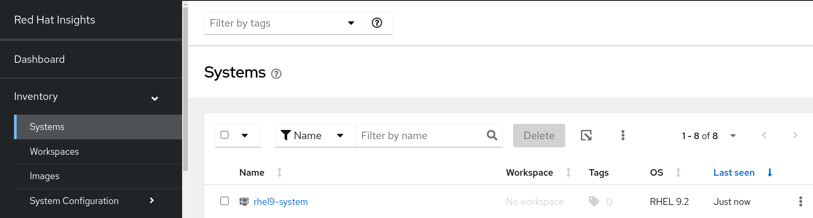
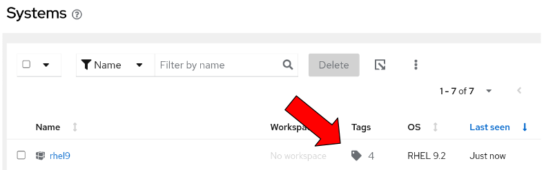

# RHEL Subscription Tracking Tips and Tricks
This is an unofficial guide to assist those who wish to improve their subscription tracking experience with the Red Hat Customer Portal via Red Hat Insights

## Introduction to Red Hat Insights
 Red Hat Insights is an included service with RHEL, accessable via the Red Hat Customer Portal. Insights can assist with standardizing custom image builds and remediating RHEL systems. See this [blog](https://www.redhat.com/en/blog/modernizing-rhel-management) for a more detailed summary of its full feature set. Today we will focus on how it can be leveraged to track RHEL utilization more efficiently.

## Step 1: Getting Started
**Prerequisites**

- The RHEL system must be registered via subscription-manager

To configure a RHEL system to be managed by Red Hat Insights, we need to install the ```insights-client``` package and register the system to the Insights service. 

1. Install the insights-client package
   
   ```bash
   dnf install insights-client
   ```
2. Register the system to the Insights service

    ```bash
    insights-client --register
    ```
3. To verify if the insights-client is reporting, navigate to the [Insights Systems Inventory](console.redhat.com/insights/inventory) via the Customer Portal. After a few minutes you should notice that your system is listed and has recently checked in via the insights-client.


## Step 2: Tagging Systems

In the above screenshot, you may have noticed the **Tags** column in our System Inventory. We can apply tags to individual systems by creating a ```tags.yaml``` file on the systems where the ```insights-client``` is installed.

1. Navigate to the insights-client directory and create your ```tags.yaml``` file (file name is important)

    ```
    cd /etc/insights-client

    touch tags.yml
    ```
2. Populate the ```tags.yaml``` file with attributes that may be useful to see in the customer portal. Note: these tags are not tied to a subscription pool or contract number associated with a system, the below example simply includes tags that may be useful to you for informational tracking purposes. Keeping that in mind, feel free to create your own custom tags for other purposes.

    Here is an example of my tags.yaml file

    ```shell
    [admin@rhel9 ~]$ cat /etc/insights-client/tags.yml
    group: rhel9
    department: Engineering
    subscription: RHEL Server Premium (instance-based)
    contractNum: 12345678

    ```

3. Refresh data with Insights service.

    ```
    insights-client --register
    ```

4. Navigate to the [Insights Systems Inventory](console.redhat.com/insights/inventory) to inspect that your tags are properly applied to your system.
    

    With our tags applied, we can now filter our entire inventory of systems based on the specific attributes we've applied. This feature is incredibly useful to keep track of where and how systems are being used in your organization.

## (Optional) Step 3: Automating the Registration and Tagging Process

While it is easy to tag individual systems, this approach isn't scalable for an entire organization. To address this, we can leverage Ansible to automate the system registration process via ```subscription-manager``` and install the ```insights-client``` for tagging purposes.

Using the above steps, let's consolidate these tasks in an Ansible playbook.

```yaml

---
- name: Register and Tag RHEL Systems for Subscription Tracking
  hosts: all
  become: yes

  vars: # If using vars file or group vars, this section is not necessary
    org_id: "<org-id>"                 # Replace with your organization ID
    activation_key: "<activation-key>" # Replace with your activation key
    tags_content: |                    # Replace these with your own tags                 
      group: "rhel9"   
      contract: "12345678"
      subscription: "RHEL Server (instance-based)" 
      serviceLevel: "Premium"

  tasks:
      # Below task is unecessary if the system is already registered
    - name: Register system with Red Hat Subscription Manager 
      command: >
        subscription-manager register
        --org={{ org_id }}
        --activationkey={{ activation_key }}
      register: subscription_manager_output
      ignore_errors: yes
      changed_when: "'Registered' in subscription_manager_output.stdout"

    - name: Install the insights-client package
      dnf:
        name: insights-client
        state: present

    - name: Register the system with Red Hat Insights
      command: insights-client --register
      register: insights_register_output
      changed_when: "'success' in insights_register_output.stdout"

    - name: Create or update tags.yaml for Insights
      copy:
        dest: /etc/insights-client/tags.yaml
        content: "{{ tags_content }}"

    - name: Refresh insights-client the system with updated tags
      command: insights-client --register
      register: insights_reregister_output
      changed_when: "'success' in insights_reregister_output.stdout"

```

**Suggestions**
- Rather than defining the variables directly in the ```vars``` section, leveraging a group vars file may be recommended to execute across a group of systems. For example, in this case, a group vars file may look something like this.

  ```yaml
  org_id: "<org-id>"                 # Replace with your account organization ID
  activation_key: "<activation-key>" # Replace with your activation key (if created)
  tags_content: |                    # Replace these with your own tags                 
    group: "rhel9"
    department: Engineering
    contract: "12345678"
    subscription: "RHEL Server (instance-based) 
    serviceLevel: "Premium"

  ```
  We can then reference this group vars file during playbook execution via ```--extra-vars``` option ([docs](https://docs.ansible.com/ansible/latest/playbook_guide/playbooks_variables.html) for reference)

  ```shell 
  ansible-playbook <playbook-name> --extra-vars /path/to/group-vars.yml 
  ```
